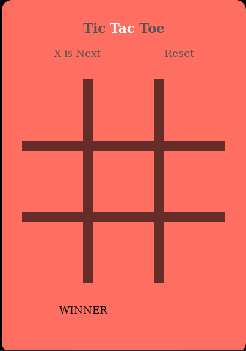

# Tic Tac Toe 

## **Summary** 
This game is a simple game Tic-Tac-Toe which can be played between two players. it developed under to learn the Javascript(DOM) and also how to use HTML and CSS to make any game.

#### **Language are used to build this game are:-**
* HTML5
* CSS3
* JAVASCRIPT(DOM)

#### If you want to play a game  link is given 
* https://aman431.github.io/Tic-Tac-Toe/ 
* if you are opening a link in mobile please open in Desktop Mode.

## **SCREENSHOT**

